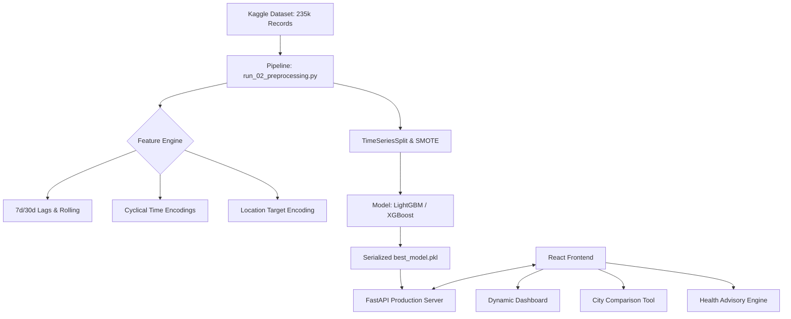

# 🌬️ Aetheris — Intelligent Air Quality Prediction & Advisory System

[](https://fastapi.tiangolo.com/)
[](https://reactjs.org/)
[](https://scikit-learn.org/)
[](https://tailwindcss.com/)

**Aetheris** is a production-grade, end-to-end Machine Learning platform engineered to predict, analyze, and visualize Air Quality Index (AQI) dynamics across 291 Indian cities. By leveraging advanced tree-based ensemble learning and rigorous time-series preprocessing, Aetheris provides high-fidelity pollution forecasts and actionable health advisories.

---

## 🚀 Key Features

*   **Zero-Leakage ML Pipeline**: Strictly enforced `TimeSeriesSplit` cross-validation to prevent temporal data leakage and ensure real-world generalizability.
*   **54-Feature Intelligence engine**: Dynamic generation of 7-day lags, 30-day rolling averages, cyclical time encodings, and geographic target encodings.
*   **Synthetic Rebalancing (SMOTE)**: Addressed the massive 160:1 class imbalance between "Satisfactory" and "Severe" days to ensure the model never misses life-threatening pollution spikes.
*   **Live Inference Backend**: A high-performance FastAPI server that reconstructs complex feature vectors on-the-fly for real-time LightGBM predictions.
*   **Modern Analytics Dashboard**: A sleek, dark-themed React interface with interactive Recharts, city-to-city comparisons, and automated health recommendations.

---

## 📊 Performance Leaderboard

After evaluating 9+ algorithms, **LightGBM** (Gradient Boosting) emerged as the champion across both tracks:

### 📈 Regression (Exact AQI Value)
| Metric | Result | Interpretation |
| :--- | :--- | :--- |
| **R² Score** | **0.904** | Explains 90% of atmospheric variance |
| **RMSE** | **20.29** | Average error of only ~4% on the full scale |
| **MAE** | **13.55** | Extremely tight precision for categorical mapping |

### 🎯 Classification (Severity Categories)
| Metric | Result | Status |
| :--- | :--- | :--- |
| **Weighted F1** | **0.875** | Robust balance between Precision & Recall |
| **Recall (Severe)** | **High** | Successfully identifies hazardous days via SMOTE |

---

## 🏗️ System Architecture



---

## 🛠️ Installation & Setup

### Backend (Python 3.9+)
```bash
# 1. Setup environment
python -m venv venv
source venv/bin/activate

# 2. Install dependencies
pip install -r requirements.txt

# 3. Train models
python run_01_eda.py
python run_02_preprocessing.py
python run_03_modeling.py   # Generated best_model.pkl

# 4. Start API
uvicorn src.api:app --reload
```

### Frontend (Node 18+)
```bash
cd frontend
npm install
npm run dev
```

---

## 📁 Project Structure

```text
aetheris/
├── src/
│   ├── api/             # FastAPI Inference Engine
│   ├── models/          # Ensemble Definitions & Logic
│   ├── preprocessing/   # Zero-leakage Engineering
│   └── evaluation/      # Time-Series Validation Suites
├── frontend/            # React + Tailwind + Vite
├── data/                # Raw & Processed data stores
├── reports/figures/     # High-res performance plots
├── models/              # Serialized Production Binaries
└── run_*.py             # Orchestration scripts 01-06
```

---

## 📜 Research Reports
For a deep dive into the methodology, exploratory analysis, and mathematical rationale, please refer to the following documents in the root:
*   [Ultimate_Thesis_Aetheris_Report.md](./Ultimate_Thesis_Aetheris_Report.md) (Complete detailed breakdown)
*   [report.md](./report.md) (Quick summary)

---
**Author**: Project Aetheris (2025)
