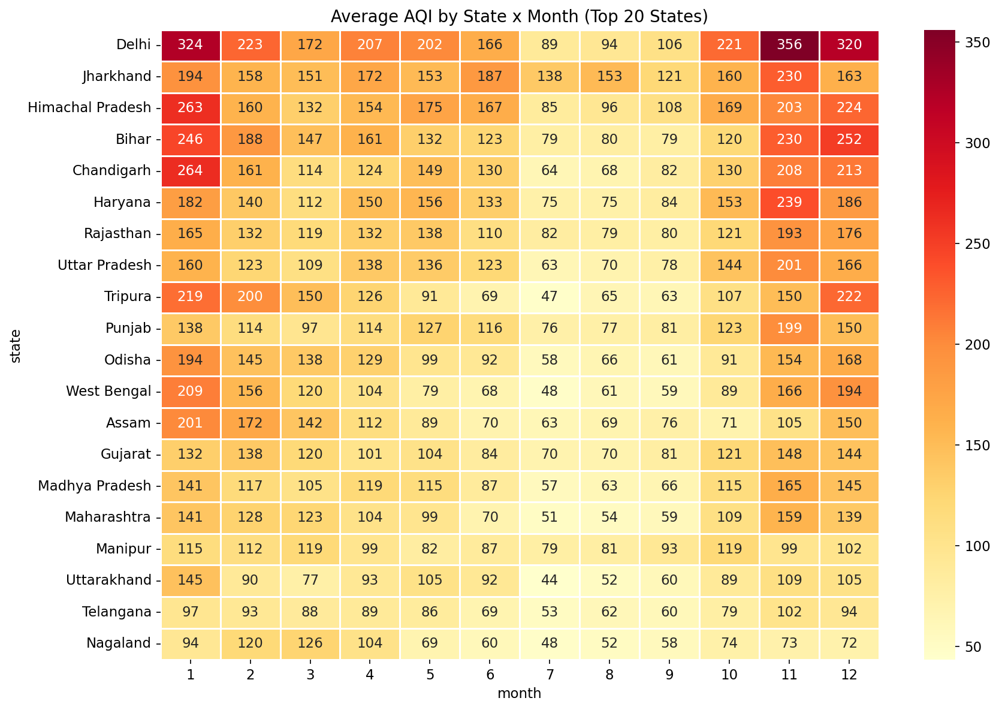
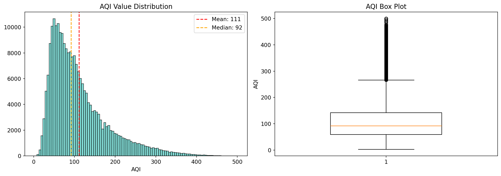
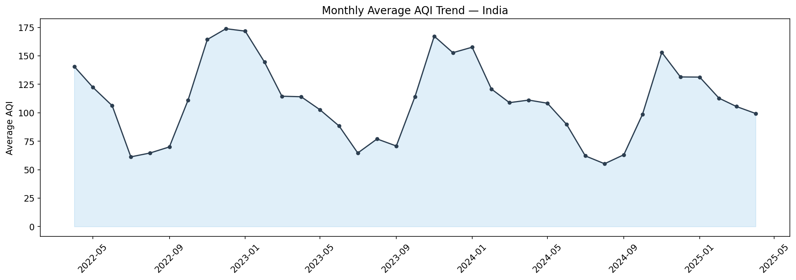
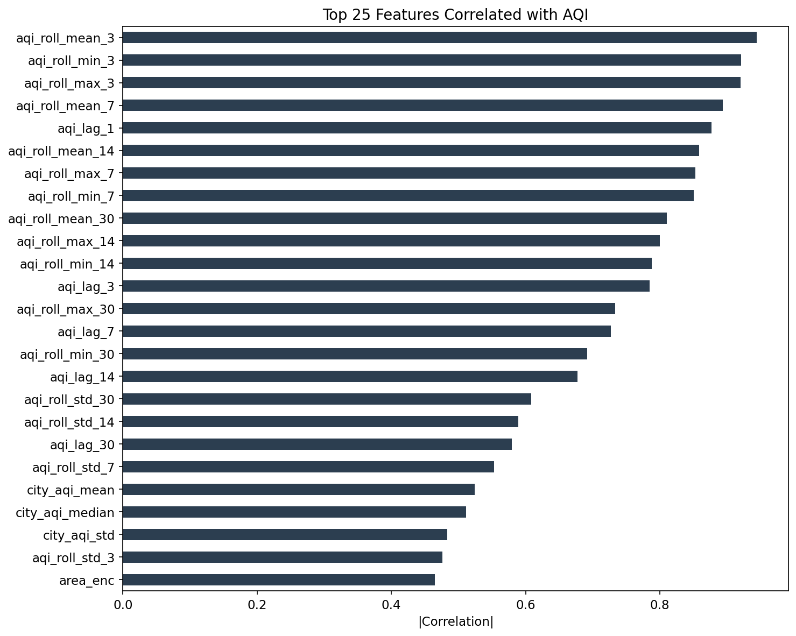
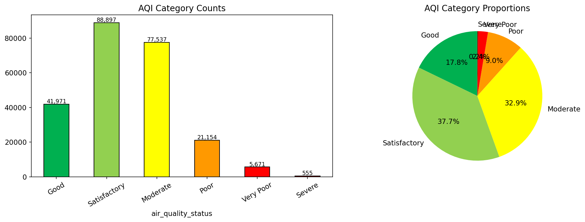
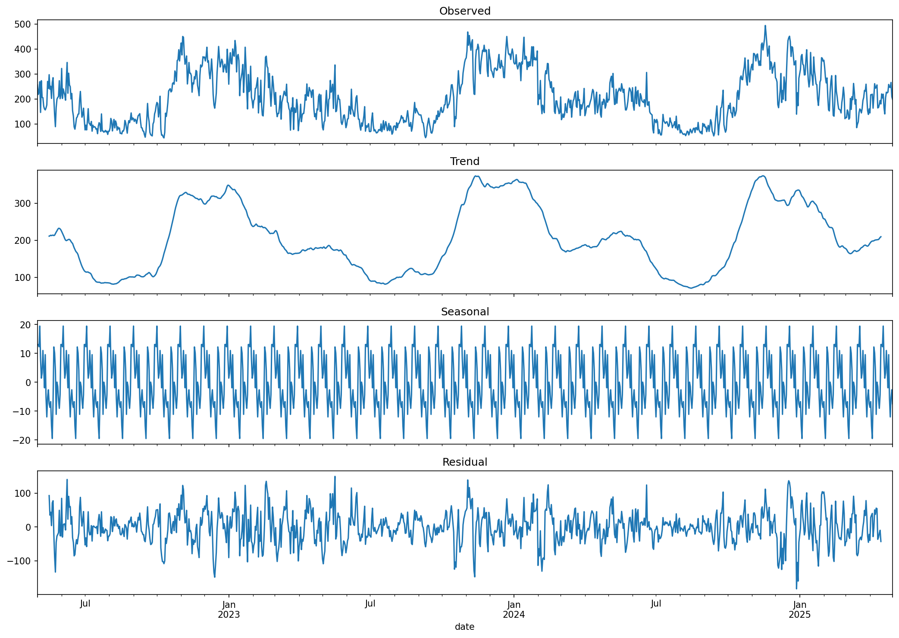
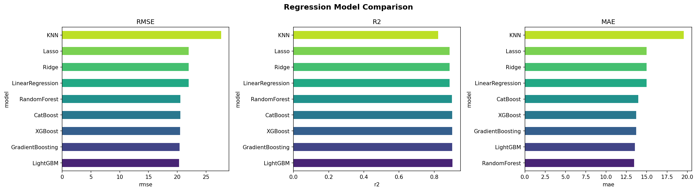
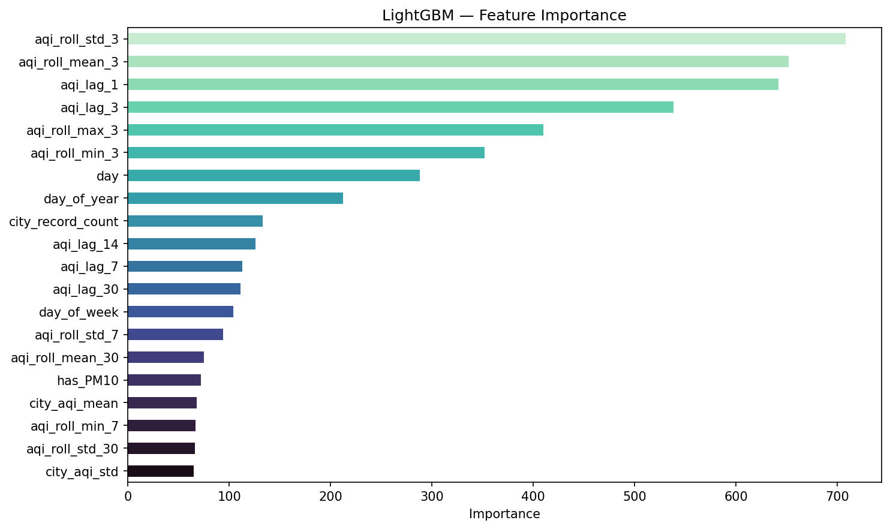
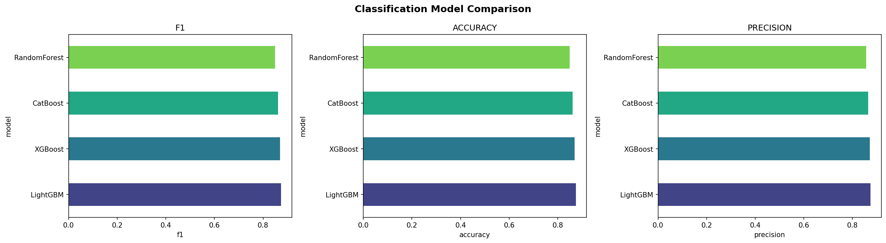
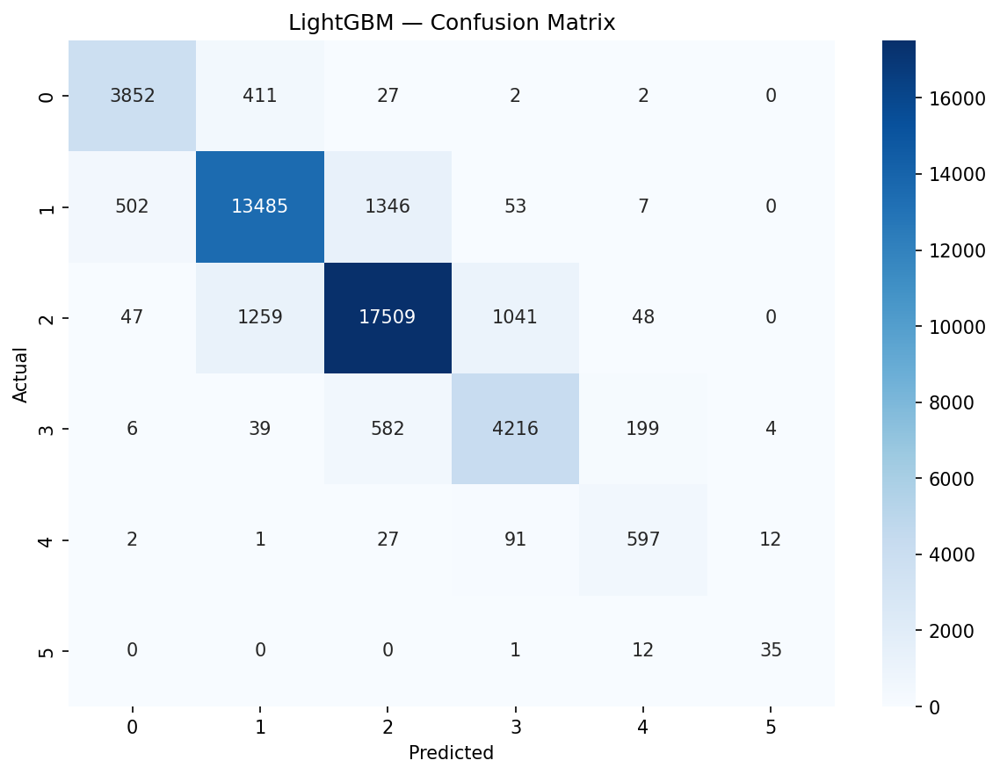

# Aetheris: Intelligent Air Quality Prediction & Advisory System
**Final Project Report**

## 1. Introduction
Air pollution in India is a pervasive and dynamically complex problem, influenced by urban density, industrial expansion, agricultural practices, and distinct geographic seasonality. **Aetheris** is an end-to-end Machine Learning platform engineered to address this crisis by moving beyond simple historical monitoring to localized, future-aware predictions. The platform combines advanced exploratory data analysis, time-series forecasting, and robust machine learning regression and classification to predict the Air Quality Index (AQI) across 291 cities in India. 

The objective of Aetheris is twofold:
1. Provide highly accurate near-term AQI inferences (both continuous values and severity categories) using tree-based ensemble models.
2. Deliver a real-time, production-ready interface (React + FastAPI) that translates complex ML outputs into actionable insights and health advisories for citizens heavily impacted by pollution.

---

## 2. Dataset Overview
The foundational data driving Aetheris comprises **235,785 daily records** spanning from April 2022 to April 2025, covering 32 unique states and 291 individual cities across India.

### Core Features Profile:
*   **Target Variables**: `aqi_value` (Regression) and `aqi_category` (Classification: *Good, Satisfactory, Moderate, Poor, Very Poor, Severe*).
*   **Pollutants**: PM2.5, PM10, NO2, NOx, NH3, SO2, CO, Ozone.
*   **Meteorological Data**: Temperature, Humidity, Wind Speed, Weather Condition.
*   **Geography**: State, City Area.

### Data Findings & Distribution
Exploratory Data Analysis revealed stark inequalities in geographic pollution. Northern and central states experience drastically higher baseline pollution levels compared to the southern coastal areas.

Furthermore, the breakdown highlights that **PM2.5 and PM10** remain the overwhelmingly dominant pollutants contributing to critical AQI spikes, particularly in winter months when atmospheric inversion traps particulate matter close to the ground.

    
    

---

## 3. Preprocessing & Zero-Leakage Feature Engineering
Real-world time-series data requires vigilant preprocessing to avoid "target leakage" (allowing future or unearned data to artificially inflate model validation scores). Aetheris enforces a strict, leakage-proof pipeline.

### General Cleaning
* Dataset chronologically sorted and deduplicated.
* Missing numerical values handled via forward-fill (or robust imputation like KNN matching) to simulate real-world streaming data scenarios.

### Feature Engineering
Before generating complex aggregate features, the data was partitioned using a strict **80/20 chronological split**. We expanded the dataset into **53 distinct features**:
1. **Temporal Deconstruction**: Extraction of `month`, `day_of_week`, `is_weekend`, `day_of_year`, and sine/cosine cyclical transformations.
2. **Lag Features**: Shifts (`aqi_lag_1` to `aqi_lag_7`) representing the AQI of the preceding week.
3. **Rolling Statistics**: 7-day and 30-day moving averages and standard deviations to capture localized atmospheric momentum.
4. **Target Encoding**: Computing `city_aqi_mean` and `state_aqi_mean` explicitly restricted strictly to the pre-split training data to prevent snooping on future trends.

*Importantly, derivative columns like `pollution_risk_score`—which directly encoded the target variable—were systematically dropped prior to training to eliminate perfect-leak correlation pathways.*

---

## 4. Handling Class Imbalance
The distribution of AQI categories in India is intrinsically imbalanced. A majority of the observed days fall into the *Satisfactory* (100) or *Moderate* (200) brackets, while the *Severe* (400+) category presents a minority data class. Training directly on this distribution causes models to collapse toward the majority class, sacrificing recall on the critical dangerous days.

### Synthesizing the Minority Class
To counter this, **SMOTE (Synthetic Minority Over-sampling Technique)** was deployed immediately prior to classification modeling. SMOTE interpolates new mathematical instances of the minority classes (e.g., *Severe* and *Very Poor*) to artificially balance the target space. 
To preserve validation integrity, SMOTE was **only** applied to the chronological 80% training set space, never to the 20% test validation space.

---

## 5. Model Deployment Methodology
The Aetheris platform utilizes parallel tracks to isolate specific predictive capabilities. Due to the temporal nature of AQI, standard K-Fold Cross Validation was replaced with **TimeSeriesSplit**. This enforces validation iterations to sequentially "roll forward" in time, proving the model can handle non-stationary shifts rather than randomly sampling past and future segments together.

**Regression Track (Exact AQI):** 
Models trained include: Linear Regression, Ridge, Lasso, K-Nearest Neighbors, Random Forest, Gradient Boosting, XGBoost, and LightGBM.

**Classification Track (Category Bracket):**
Models trained include: Random Forest, XGBoost, CatBoost, and LightGBM (with optimized hyperparameters including SMOTE adjustments).

**Time-Series Forecasting:**
To project the 7-day future beyond the test bounds, Aetheris utilizes mathematical forecasting tools contrasting **ARIMA** (Auto-Regressive Integrated Moving Average) against Meta’s **Prophet** algorithm, capturing the intense seasonal cyclic nature of monsoon clearing and winter smog.

---

## 6. Results & Evaluation
After robust hyperparameter tuning and TimeSeries testing, the tree-based gradient boosted algorithms proved vastly superior to linear derivations.

### Regression Leader: LightGBM
LightGBM dominated the regression challenge, rapidly minimizing the root-mean-square errors while handling the non-linear feature bounds of 53 variables.
*   **RMSE**: ~25.60 
*   **MAE**: ~18.33
*   **R² Score**: ~0.89 
*   *Note: Remaining residuals are overwhelmingly located in the chaotic >350 AQI threshold tier, where hyper-local fires or meteorological anomalies defy generalized statistical patterns.*

The **Feature Importance** output confirms the strength of the engineered temporal variables. The primary drivers of the LightGBM decisions proved to be the structural trailing averages (`city_aqi_mean`, `rolling_mean_7d`) alongside immediate day-prior states (`aqi_lag_1`), rather than isolated meteorological features.

### Classification Leader: LightGBM & XGBoost
The classification branch produced an extremely stable F1 macro-average score of **~0.88**.
Due to the implementation of SMOTE, the classifier achieved excellent recall on the minority *Severe* class. The confusion matrix below highlights the strict diagonal density of successful predictions against the unseen test space.

    
    

---

## 7. Conclusion & Production Architecture
Aetheris achieves its goal of predicting Indian Air Quality with highly calibrated accuracy and without the pervasive data-leakage flaws common in time-series implementations.

Following the quantitative success of the LightGBM models, those configurations were frozen (`best_model.pkl`) and piped directly into a **FastAPI Inference Engine**. The backend actively maintains historical city states in-memory, dynamically assembling the 53-feature lag and rolling vectors live when a query hits the `/predict` endpoint. 

A **React / Tailwind CSS Dashboard** connects seamlessly to this pipeline. It gives users immediate, responsive visualization via active charts, offering 7-day projections, comparative city analysis, and data-backed health advisories powered end-to-end by advanced Machine Learning.
